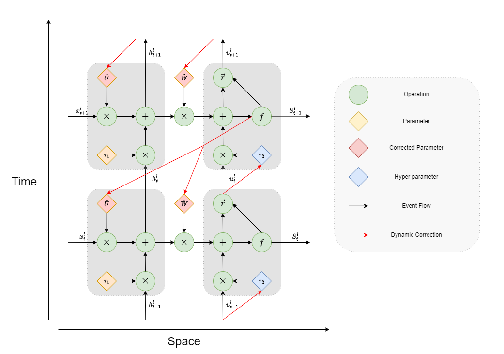

# SNN_Eval

#### Pycharm Implementation of SNN Eval,City University of Macau

When facing the issue of lightweight spiking neural networks, we aim to improve the accuracy of SNN networks and reduce memory usage by integrating dynamic corrections through pulse encoding and overall collaborative optimization:



#### Feature Comparison of SNN calibration

| Features     | Dynamic Coding | Dynamic Correction | Co-Optimization | Complete Component |
| ------------ | -------------- | ------------------ | --------------- | ------------------ |
| Acc          | General        | 1~2% ⇧             | 1~2% ⇧          | 2~3% ⇧             |
| Epoch        | General        | Low                | Low             | Low                |
| T            | General        | General            | Low             | Low                |
| Spikes Count | High           | High               | Low             | Low                |
| Energy       | Low            | Low                | Middle          | High               |

#### Requirements

python --version==3.10

torch==2.4.1

numpy==1.26.1

torchvision==0.19.1

snntorch==0.9.1

time==2.9.1

h5py==3.11.0

requests==2.31.0

#### Quick Start

To run the model quickly, first download the appropriate packages as required.

```bash
pip install -r requirements.txt
```

The specific execution code is in the file "run.eval", and the following code runs using ''mnist'' as an example.

```bash
chmod +x run_eval.sh
./run_eval.sh --models mnist ./model.pth --device cuda
```

To obtain the complete script in the run_add script for each group's results.

```bash
chmod +x run_eval.sh
./run_eval.sh --models mnist ./model.pth --device cuda

chmod +x run_eval.sh
./run_eval.sh --models cifar-10 ./model.pth --device cuda

chmod +x run_eval.sh
./run_eval.sh --models cifar-100 ./model.pth --device cuda

chmod +x run_eval.sh
./run_eval.sh --models cifar10-dvs ./model.pth --device cuda

chmod +x run_eval.sh
./run_eval.sh --models dvs-gesture ./model.pth --device cuda

chmod +x run_eval.sh
./run_eval.sh --models nmnist ./model.pth --device cuda
```

#### SNN_Eval Results

|             | Accuracy | Epoch | T    | Spikes Count |
| ----------- | -------- | ----- | ---- | ------------ |
| MNIST       | 98.2%    | 35    | 8    | 180          |
| CIFAR-10    | 90.5%    | 150   | 20   | 900          |
| CIFAR-100   | 64.9%    | 250   | 25   | 1500         |
| CIFAR10-DVS | 74.5%    | 90    | 20   | 900          |
| DVS-Gesture | 96.8%    | 50    | 10   | 480          |
| NMNIST      | 98.5%    | 35    | 8    | 180          |

#### SNN_Eval Ablation Results

##### MNIST:

| MNIST              | Accuracy | Epoch | T    | Spikes Count |
| ------------------ | -------- | ----- | ---- | ------------ |
| Dynamic Coding     | 97.6%    | 60    | 20   | 400          |
| Dynamic Correction | 98.2%    | 45    | 20   | 380          |
| Co-Optimization    | 98.0%    | 35    | 8    | 150          |
| Complete Component | 98.2%    | 35    | 8    | 180          |

##### CIFAR10-DVS：

| CIFAR10-DVS        | Accuracy | Epoch | T    | Spikes Count |
| ------------------ | -------- | ----- | ---- | ------------ |
| Dynamic Coding     | 71.9%    | 120   | 50   | 1800         |
| Dynamic Correction | 73.1%    | 90    | 40   | 1700         |
| Co-Optimization    | 72.9%    | 110   | 50   | 900          |
| Complete Component | 74.5%    | 90    | 20   | 900          |

